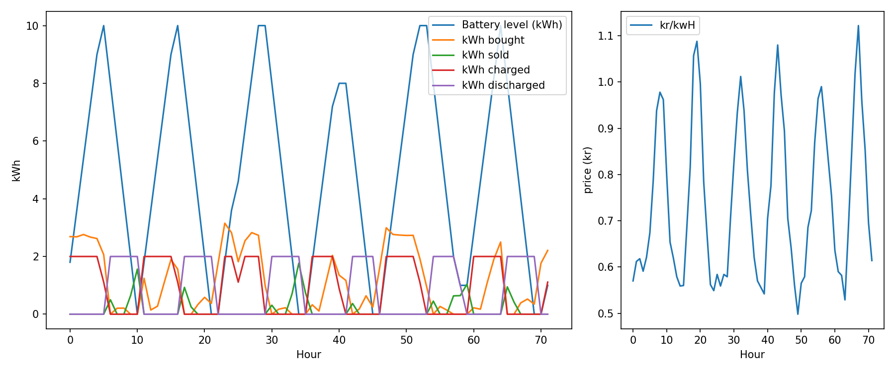

# Home Battery Optimization

An optimization model that schedules a home battery to minimize weekly electricity
costs. Given hourly electricity prices, household consumption and solar production, it
decides for every hour how much to buy, sell, charge, and discharge.

The model is a linear program built with [Pyomo](http://www.pyomo.org/) and solved with the
[HiGHS](https://highs.dev/) solver.



## The problem

A house with solar panels, a battery, and a grid connection. Each hour:

The model chooses the cheapest way to keep the house powered across the week, exploiting the
gap between cheap night-time prices and expensive evening peaks by storing energy in the
battery and releasing it when it's most valuable.

## The model

**Decision variables (per hour):** amount bought, sold, charged, discharged, and the
battery's state of charge.

**Objective:** minimize total cost = price paid to buy − money earned selling, summed over
all hours.

**Constraints:**
- **Energy balance** — every hour, energy in (solar + bought + discharged) equals energy out
  (consumption + sold + charged).
- **Battery dynamics** — the battery level each hour equals the previous hour's level plus
  what was charged (minus charging losses) minus what was discharged.
- **Capacity & rate limits** — the battery can't exceed its capacity, and can only
  charge/discharge a limited amount per hour.
- **Cyclic condition** — the battery ends the week at the same level it started, so the plan
  is repeatable.

## Realistic battery behaviour

The model includes two physical effects that make the result realistic:

- **Charge/discharge rate limit** — the battery fills and empties gradually (e.g. 5 kW max),
  not instantly.
- **Round-trip efficiency** — energy is lost when charging (~10%), so the battery only
  arbitrages price gaps large enough to be worth the loss.

## Tech stack

Python, Pyomo, HiGHS, pandas, Matplotlib.

## Running it

1. Clone the repository.
2. Install the dependencies:
   ```bash
   pip install -r requirements.txt
   ```
3. Run the model:
   ```bash
   python model.py
   ```

This prints the solver status and total cost, prints the hourly plan as a table, and saves a
chart (`result.png`) showing the battery's strategy against the electricity price.

## Data

`energy_data.csv` contains one week of hourly sample data (price, consumption, solar). Prices dip at night and peak in the evening, solar follows a midday
curve, but the values are synthetic.

## Possible extensions

- Different buy and sell prices (grid fees / feed-in tariffs).
- Real Norwegian price and weather data via public APIs.
- An interactive dashboard (Streamlit) to explore different battery sizes and timeframes.